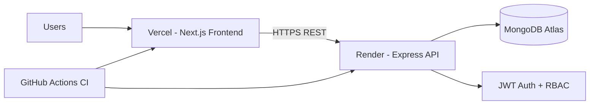

# LocalSpot Booker Architecture

## Domain modules

- Auth: signup, login, current user profile.
- Listings: create/search/update listings by category and area.
- Reservations: book and track reservations/appointments.

## Separation of concerns

- Frontend separates features into `auth`, `listings`, `reservations`, `hooks`, and `services`.
- Backend separates concerns by `models`, `controllers`, `routes`, `middleware`, and `services`.
- API contracts are centralized in typed DTOs and request schemas.
